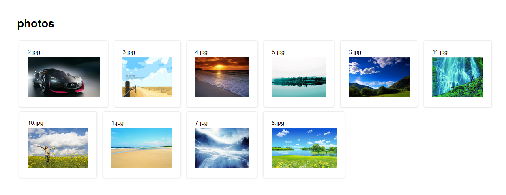

##设计说明
本应用采用了express搭建的框架，然后用busboy模块处理上传的照片，采用mongodb数据库，通过mongoose处理数据库操作。功能上目前只提供简单的照片上传和下载
##访问路由说明：
get('/') 首页面：展示已经上传的图片  
get('/upload') 上传图片功能页面  
post('/upload') 向服务器发送上传图片请求，上传成功重定向到首页面  
get('/photo/:id/download') 点击图片向服务器发送图片id下载图片  
##项目部分结构说明：
models: mongoose模型  
public: 静态网页目录  
routes: 路由控制，controller  
views: 路由模版  
app.js: 程序入口  

##应用展示
